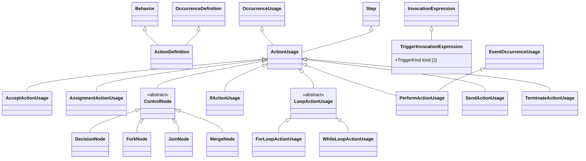

# Actions — class diagram

> Generated by `tools/metamodel-gen` — do not edit by hand; re-run the generator.

17 metaclasses in this package, 6 boundary nodes from other packages.

Derived features are omitted. Primitive- and enumeration-typed features are shown inside the class
box; metaclass-typed features are shown as edges (`*--` composition, `-->` association). Boundary
nodes are drawn without their own contents and are never expanded further.

## Elements

- [AcceptActionUsage](../elements/AcceptActionUsage.md)
- [ActionDefinition](../elements/ActionDefinition.md)
- [ActionUsage](../elements/ActionUsage.md)
- [AssignmentActionUsage](../elements/AssignmentActionUsage.md)
- [ControlNode](../elements/ControlNode.md)
- [DecisionNode](../elements/DecisionNode.md)
- [ForLoopActionUsage](../elements/ForLoopActionUsage.md)
- [ForkNode](../elements/ForkNode.md)
- [IfActionUsage](../elements/IfActionUsage.md)
- [JoinNode](../elements/JoinNode.md)
- [LoopActionUsage](../elements/LoopActionUsage.md)
- [MergeNode](../elements/MergeNode.md)
- [PerformActionUsage](../elements/PerformActionUsage.md)
- [SendActionUsage](../elements/SendActionUsage.md)
- [TerminateActionUsage](../elements/TerminateActionUsage.md)
- [TriggerInvocationExpression](../elements/TriggerInvocationExpression.md)
- [WhileLoopActionUsage](../elements/WhileLoopActionUsage.md)
