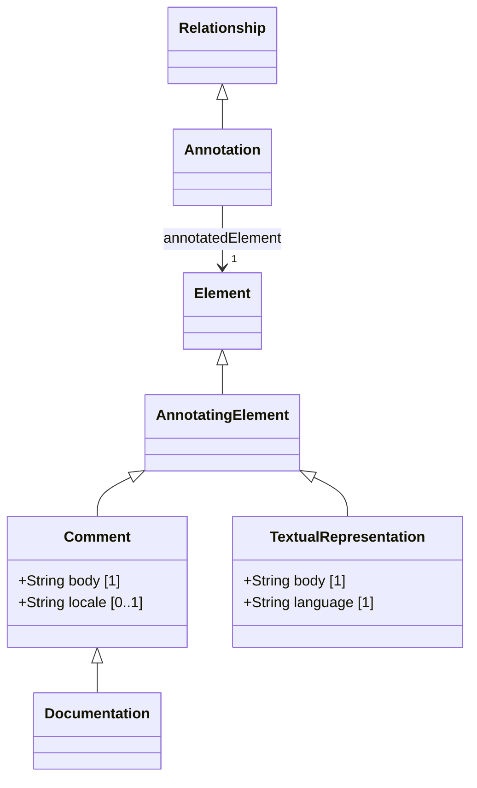

# Annotations — class diagram

> Generated by `tools/metamodel-gen` — do not edit by hand; re-run the generator.

5 metaclasses in this package, 2 boundary nodes from other packages.

Derived features are omitted. Primitive- and enumeration-typed features are shown inside the class
box; metaclass-typed features are shown as edges (`*--` composition, `-->` association). Boundary
nodes are drawn without their own contents and are never expanded further.

## Elements

- [AnnotatingElement](../elements/AnnotatingElement.md)
- [Annotation](../elements/Annotation.md)
- [Comment](../elements/Comment.md)
- [Documentation](../elements/Documentation.md)
- [TextualRepresentation](../elements/TextualRepresentation.md)
