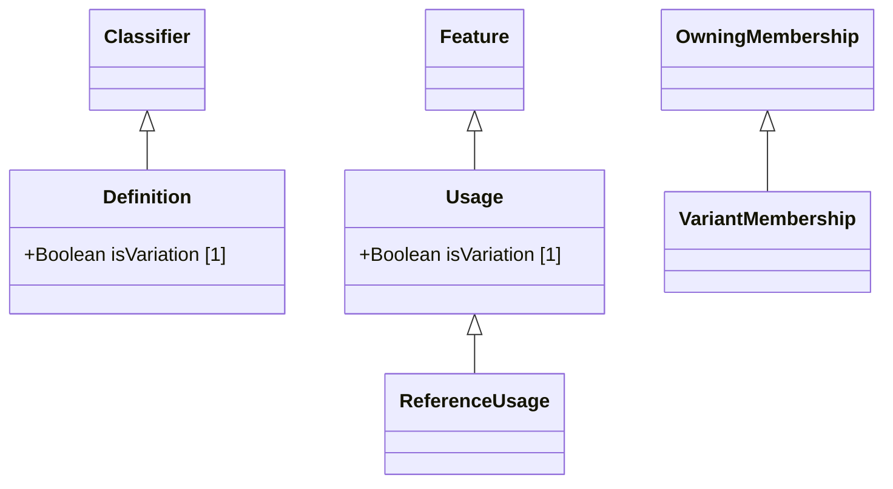

# DefinitionAndUsage — class diagram

> Generated by `tools/metamodel-gen` — do not edit by hand; re-run the generator.

4 metaclasses in this package, 3 boundary nodes from other packages.

Derived features are omitted. Primitive- and enumeration-typed features are shown inside the class
box; metaclass-typed features are shown as edges (`*--` composition, `-->` association). Boundary
nodes are drawn without their own contents and are never expanded further.

## Elements

- [Definition](../elements/Definition.md)
- [ReferenceUsage](../elements/ReferenceUsage.md)
- [Usage](../elements/Usage.md)
- [VariantMembership](../elements/VariantMembership.md)
