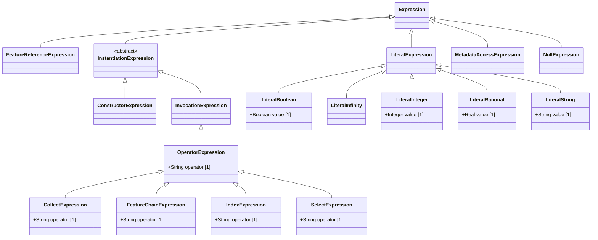

# Expressions — class diagram

> Generated by `tools/metamodel-gen` — do not edit by hand; re-run the generator.

17 metaclasses in this package, 1 boundary nodes from other packages.

Derived features are omitted. Primitive- and enumeration-typed features are shown inside the class
box; metaclass-typed features are shown as edges (`*--` composition, `-->` association). Boundary
nodes are drawn without their own contents and are never expanded further.

## Elements

- [CollectExpression](../elements/CollectExpression.md)
- [ConstructorExpression](../elements/ConstructorExpression.md)
- [FeatureChainExpression](../elements/FeatureChainExpression.md)
- [FeatureReferenceExpression](../elements/FeatureReferenceExpression.md)
- [IndexExpression](../elements/IndexExpression.md)
- [InstantiationExpression](../elements/InstantiationExpression.md)
- [InvocationExpression](../elements/InvocationExpression.md)
- [LiteralBoolean](../elements/LiteralBoolean.md)
- [LiteralExpression](../elements/LiteralExpression.md)
- [LiteralInfinity](../elements/LiteralInfinity.md)
- [LiteralInteger](../elements/LiteralInteger.md)
- [LiteralRational](../elements/LiteralRational.md)
- [LiteralString](../elements/LiteralString.md)
- [MetadataAccessExpression](../elements/MetadataAccessExpression.md)
- [NullExpression](../elements/NullExpression.md)
- [OperatorExpression](../elements/OperatorExpression.md)
- [SelectExpression](../elements/SelectExpression.md)
