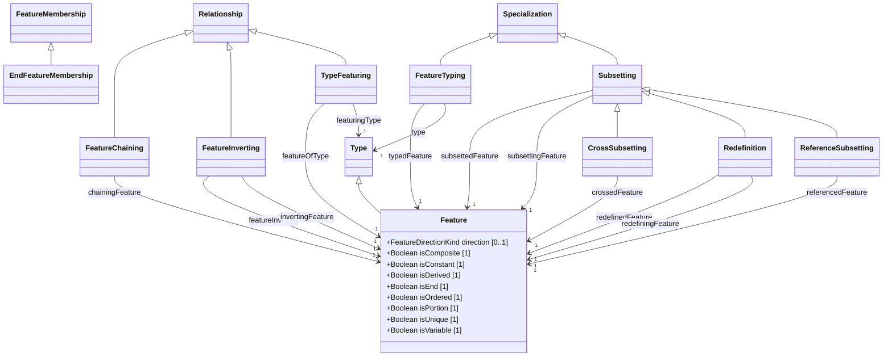

# Features — class diagram

> Generated by `tools/metamodel-gen` — do not edit by hand; re-run the generator.

10 metaclasses in this package, 4 boundary nodes from other packages.

Derived features are omitted. Primitive- and enumeration-typed features are shown inside the class
box; metaclass-typed features are shown as edges (`*--` composition, `-->` association). Boundary
nodes are drawn without their own contents and are never expanded further.

## Elements

- [CrossSubsetting](../elements/CrossSubsetting.md)
- [EndFeatureMembership](../elements/EndFeatureMembership.md)
- [Feature](../elements/Feature.md)
- [FeatureChaining](../elements/FeatureChaining.md)
- [FeatureInverting](../elements/FeatureInverting.md)
- [FeatureTyping](../elements/FeatureTyping.md)
- [Redefinition](../elements/Redefinition.md)
- [ReferenceSubsetting](../elements/ReferenceSubsetting.md)
- [Subsetting](../elements/Subsetting.md)
- [TypeFeaturing](../elements/TypeFeaturing.md)
