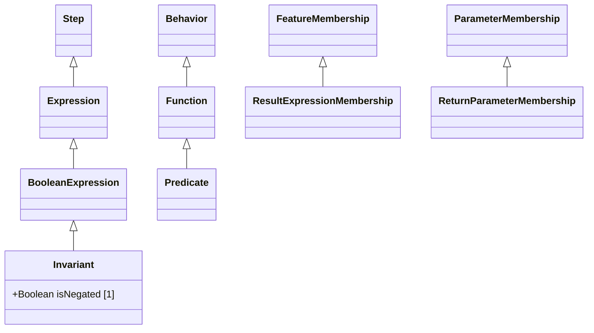

# Functions — class diagram

> Generated by `tools/metamodel-gen` — do not edit by hand; re-run the generator.

7 metaclasses in this package, 4 boundary nodes from other packages.

Derived features are omitted. Primitive- and enumeration-typed features are shown inside the class
box; metaclass-typed features are shown as edges (`*--` composition, `-->` association). Boundary
nodes are drawn without their own contents and are never expanded further.

## Elements

- [BooleanExpression](../elements/BooleanExpression.md)
- [Expression](../elements/Expression.md)
- [Function](../elements/Function.md)
- [Invariant](../elements/Invariant.md)
- [Predicate](../elements/Predicate.md)
- [ResultExpressionMembership](../elements/ResultExpressionMembership.md)
- [ReturnParameterMembership](../elements/ReturnParameterMembership.md)
