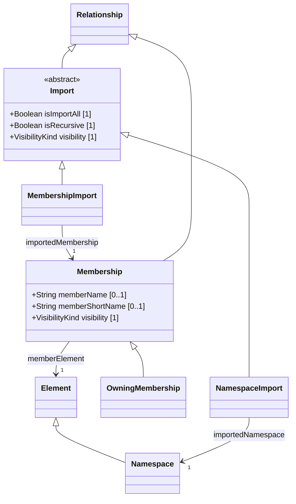

# Namespaces — class diagram

> Generated by `tools/metamodel-gen` — do not edit by hand; re-run the generator.

6 metaclasses in this package, 2 boundary nodes from other packages.

Derived features are omitted. Primitive- and enumeration-typed features are shown inside the class
box; metaclass-typed features are shown as edges (`*--` composition, `-->` association). Boundary
nodes are drawn without their own contents and are never expanded further.

## Elements

- [Import](../elements/Import.md)
- [Membership](../elements/Membership.md)
- [MembershipImport](../elements/MembershipImport.md)
- [Namespace](../elements/Namespace.md)
- [NamespaceImport](../elements/NamespaceImport.md)
- [OwningMembership](../elements/OwningMembership.md)
