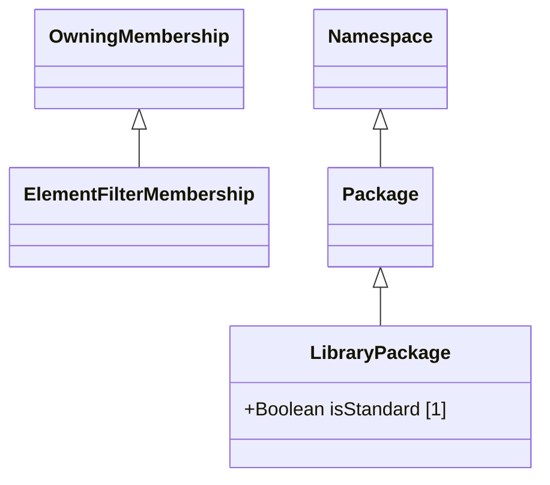

# Packages — class diagram

> Generated by `tools/metamodel-gen` — do not edit by hand; re-run the generator.

3 metaclasses in this package, 2 boundary nodes from other packages.

Derived features are omitted. Primitive- and enumeration-typed features are shown inside the class
box; metaclass-typed features are shown as edges (`*--` composition, `-->` association). Boundary
nodes are drawn without their own contents and are never expanded further.

## Elements

- [ElementFilterMembership](../elements/ElementFilterMembership.md)
- [LibraryPackage](../elements/LibraryPackage.md)
- [Package](../elements/Package.md)
