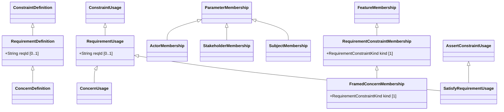

# Requirements — class diagram

> Generated by `tools/metamodel-gen` — do not edit by hand; re-run the generator.

10 metaclasses in this package, 5 boundary nodes from other packages.

Derived features are omitted. Primitive- and enumeration-typed features are shown inside the class
box; metaclass-typed features are shown as edges (`*--` composition, `-->` association). Boundary
nodes are drawn without their own contents and are never expanded further.

## Elements

- [ActorMembership](../elements/ActorMembership.md)
- [ConcernDefinition](../elements/ConcernDefinition.md)
- [ConcernUsage](../elements/ConcernUsage.md)
- [FramedConcernMembership](../elements/FramedConcernMembership.md)
- [RequirementConstraintMembership](../elements/RequirementConstraintMembership.md)
- [RequirementDefinition](../elements/RequirementDefinition.md)
- [RequirementUsage](../elements/RequirementUsage.md)
- [SatisfyRequirementUsage](../elements/SatisfyRequirementUsage.md)
- [StakeholderMembership](../elements/StakeholderMembership.md)
- [SubjectMembership](../elements/SubjectMembership.md)
