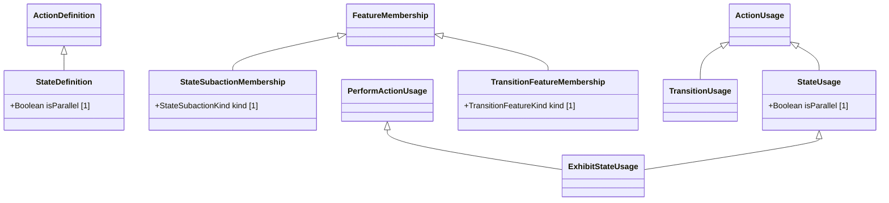

# States — class diagram

> Generated by `tools/metamodel-gen` — do not edit by hand; re-run the generator.

6 metaclasses in this package, 4 boundary nodes from other packages.

Derived features are omitted. Primitive- and enumeration-typed features are shown inside the class
box; metaclass-typed features are shown as edges (`*--` composition, `-->` association). Boundary
nodes are drawn without their own contents and are never expanded further.

## Elements

- [ExhibitStateUsage](../elements/ExhibitStateUsage.md)
- [StateDefinition](../elements/StateDefinition.md)
- [StateSubactionMembership](../elements/StateSubactionMembership.md)
- [StateUsage](../elements/StateUsage.md)
- [TransitionFeatureMembership](../elements/TransitionFeatureMembership.md)
- [TransitionUsage](../elements/TransitionUsage.md)
