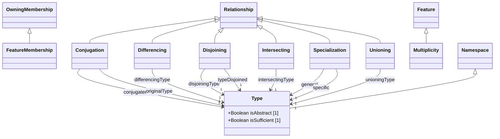

# Types — class diagram

> Generated by `tools/metamodel-gen` — do not edit by hand; re-run the generator.

9 metaclasses in this package, 4 boundary nodes from other packages.

Derived features are omitted. Primitive- and enumeration-typed features are shown inside the class
box; metaclass-typed features are shown as edges (`*--` composition, `-->` association). Boundary
nodes are drawn without their own contents and are never expanded further.

## Elements

- [Conjugation](../elements/Conjugation.md)
- [Differencing](../elements/Differencing.md)
- [Disjoining](../elements/Disjoining.md)
- [FeatureMembership](../elements/FeatureMembership.md)
- [Intersecting](../elements/Intersecting.md)
- [Multiplicity](../elements/Multiplicity.md)
- [Specialization](../elements/Specialization.md)
- [Type](../elements/Type.md)
- [Unioning](../elements/Unioning.md)
