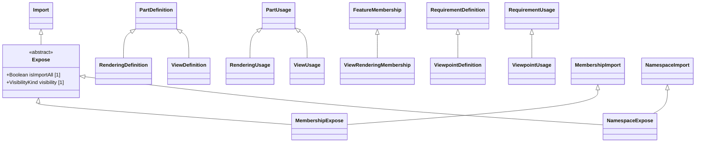

# Views — class diagram

> Generated by `tools/metamodel-gen` — do not edit by hand; re-run the generator.

10 metaclasses in this package, 8 boundary nodes from other packages.

Derived features are omitted. Primitive- and enumeration-typed features are shown inside the class
box; metaclass-typed features are shown as edges (`*--` composition, `-->` association). Boundary
nodes are drawn without their own contents and are never expanded further.

## Elements

- [Expose](../elements/Expose.md)
- [MembershipExpose](../elements/MembershipExpose.md)
- [NamespaceExpose](../elements/NamespaceExpose.md)
- [RenderingDefinition](../elements/RenderingDefinition.md)
- [RenderingUsage](../elements/RenderingUsage.md)
- [ViewDefinition](../elements/ViewDefinition.md)
- [ViewRenderingMembership](../elements/ViewRenderingMembership.md)
- [ViewUsage](../elements/ViewUsage.md)
- [ViewpointDefinition](../elements/ViewpointDefinition.md)
- [ViewpointUsage](../elements/ViewpointUsage.md)
